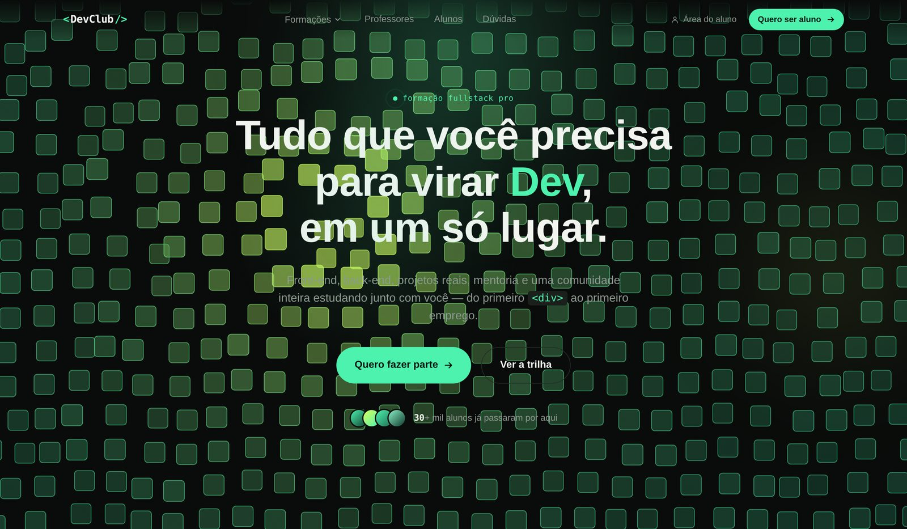

<div align="center">

# &lt;DevClub/&gt; — Página Institucional

Landing page institucional não-oficial, construída como estudo de estilo e animação para uma formação fullstack, com HTML, CSS e JavaScript puros.

[](#)
[](#)
[](#)
[](LICENSE)
[](CONTRIBUTING.md)

</div>

<p align="center">
  
</p>

---

## ⚠️ Aviso importante

Este é um **projeto independente e não-oficial**, feito como exercício de front-end e referência de estilo/animação, inspirado no site [devclub.com.br](https://www.devclub.com.br/). **Não tem qualquer afiliação, patrocínio ou vínculo com o DevClub real.** Os depoimentos, valores salariais, nomes de instrutores e demais conteúdos são **ilustrativos** — feitos para preencher o layout, não para representar fatos reais. Antes de publicar este projeto como se fosse a página oficial de alguma marca, substitua todo o conteúdo de exemplo por informações verdadeiras e com autorização.

---

## ✨ Destaques

- **Hero com "cortina" de cubos 3D** — grade de cubos em Canvas 2D, projetada com perspectiva manual (sem bibliotecas 3D externas), que ondula sozinha para frente/trás/lados e reage à posição do mouse como se fosse um tecido sendo tocado.
- **Editor de código que digita sozinho** — mockup de laptop com um editor simulando a escrita de HTML/CSS/JS em loop, com abas clicáveis.
- **Formulários funcionais de verdade** — "Área do aluno" abre um modal de login (com fluxo de "esqueci minha senha"), e todos os botões "Quero..." abrem um modal de matrícula com o interesse pré-selecionado (Formação FullStack Pro ou MBA). Validação client-side, mensagens de erro por campo, estado de sucesso animado — tudo sem back-end (formulários de demonstração, não enviam dados a servidor nenhum).
- **Seção de MBA em Inteligência Artificial** — com trilha por trimestres, diferenciais e CTA próprio.
- **Scroll reveal** — elementos entram suavemente conforme a rolagem, via `IntersectionObserver`.
- **Marquees infinitos** — carrosséis automáticos de tecnologias, empresas e módulos bônus, pausam no hover.
- **Carrossel de depoimentos** — com dots, setas, autoplay e suporte a swipe no touch.
- **Acordeão de FAQ**, **contador animado**, **gráfico de barras animado** e **menu mobile** — tudo em JavaScript vanilla, sem frameworks.
- **Respeita `prefers-reduced-motion`** — quem prefere menos animação recebe uma versão estática.
- **100% responsivo**, de telas pequenas a desktops grandes.
- **Zero dependências de build** — abra o `index.html` e está rodando.

## 🧱 Tecnologias

| Camada       | Tecnologia                                              |
|--------------|-----------------------------------------------------------|
| Estrutura    | HTML5 semântico                                            |
| Estilo       | CSS3 puro (custom properties, grid, flexbox, `mask-image`) |
| Interação    | JavaScript (ES6+), sem frameworks ou bibliotecas externas  |
| Tipografia   | [Space Grotesk](https://fonts.google.com/specimen/Space+Grotesk), [JetBrains Mono](https://fonts.google.com/specimen/JetBrains+Mono) e [Manrope](https://fonts.google.com/specimen/Manrope), via Google Fonts |

Não há bundler, transpilador ou gerenciador de pacotes obrigatório — o projeto é HTML/CSS/JS estático "puro".

## 📁 Estrutura de pastas

```
devclub-site/
├── index.html          # marcação de todas as seções da página
├── style.css            # estilos, tokens de design e animações CSS
├── script.js             # interações, scroll reveal e a cortina de cubos 3D
├── docs/
│   └── preview.jpg      # screenshot usado neste README
├── README.md
├── LICENSE
├── CONTRIBUTING.md
├── package.json          # metadados + atalho opcional para servir localmente
└── .gitignore
```

## 🚀 Como rodar localmente

Por ser um site estático, **não há instalação nem build**. Basta servir os arquivos — abrir o `index.html` direto no navegador funciona, mas alguns navegadores restringem `fetch`/módulos em `file://`, então o recomendado é subir um servidor local simples:

```bash
# clonar o repositório
git clone https://github.com/<seu-usuario>/<seu-repositorio>.git
cd <seu-repositorio>

# opção 1 — Python (já vem instalado na maioria dos sistemas)
python3 -m http.server 8080

# opção 2 — Node, sem instalar nada globalmente
npx serve .

# opção 3 — usando o script já configurado no package.json
npm run dev
```

Depois é só abrir **http://localhost:8080** (ou a porta indicada no terminal).

Se preferir, também funciona com a extensão **Live Server** do VS Code — clique com o botão direito em `index.html` → "Open with Live Server".

## 🎨 Customização

Todas as cores, fontes e espaçamentos centrais ficam em variáveis CSS no topo do `style.css`:

```css
:root{
  --bg: #090B0A;        /* fundo geral */
  --green: #4CF2AE;     /* cor de destaque principal */
  --lime: #D8FF5C;      /* brilho de destaque secundário */
  --font-display: 'Space Grotesk', sans-serif;
  --font-mono: 'JetBrains Mono', monospace;
  --font-body: 'Manrope', sans-serif;
  ...
}
```

Trocar esses valores já propaga a mudança para o site inteiro (botões, ícones, grade animada, etc.).

A cortina de cubos 3D do hero pode ser ajustada em `script.js`, dentro de `initWaveGrid()`:

| Variável      | O que controla                                             |
|---------------|--------------------------------------------------------------|
| `spacing`     | Distância entre os cubos (densidade da grade)                |
| `cellFill`    | Tamanho do cubo em relação ao espaçamento (0–1)               |
| `waveAmp`     | Intensidade da ondulação automática (para frente/trás)        |
| `rippleAmp`   | Força do "empurrão" que o cursor causa na grade               |
| `swayAmp`     | Intensidade do balanço lateral                                |

## ♿ Acessibilidade e performance

- Anima com `requestAnimationFrame` e pausa quando o hero sai da viewport (`IntersectionObserver`), economizando CPU/bateria ao rolar a página.
- Detecta `prefers-reduced-motion` e desativa animações contínuas para quem configurou essa preferência no sistema.
- Densidade da grade de cubos se adapta ao tamanho da tela para manter bom desempenho em aparelhos móveis.
- Contraste de texto pensado para leitura sobre o fundo escuro.

## 🗺️ Possíveis próximos passos

- [ ] Substituir depoimentos, nomes de instrutores e valores salariais ilustrativos por conteúdo real (caso o projeto vire algo oficial).
- [ ] Adicionar testes automatizados de acessibilidade (ex.: `axe-core`).
- [ ] Configurar deploy automático (GitHub Pages, Vercel ou Netlify) via GitHub Actions.
- [ ] Adicionar meta tags Open Graph com imagem de preview própria.

## 🤝 Contribuindo

Contribuições são bem-vindas! Veja o guia em [CONTRIBUTING.md](CONTRIBUTING.md) antes de abrir um Pull Request.

## 📄 Licença

O **código** deste repositório está sob a licença [MIT](LICENSE) — use, modifique e reaproveite como quiser, mantendo os créditos.

Isso **não** se estende à marca, identidade visual, textos originais ou qualquer material de propriedade do DevClub real ou de terceiros eventualmente referenciados neste projeto.

---

<div align="center">
  <sub>Feito como estudo de front-end e animações web. Não afiliado ao DevClub oficial.</sub>
</div>
